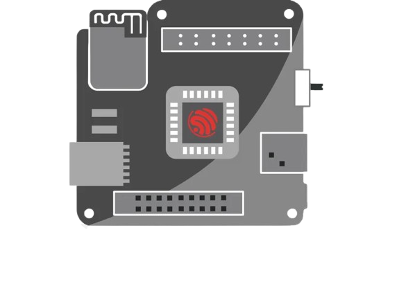
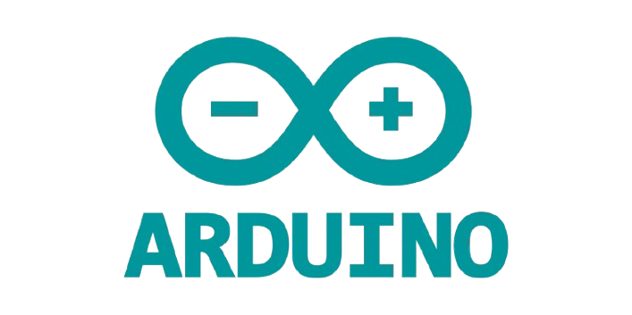
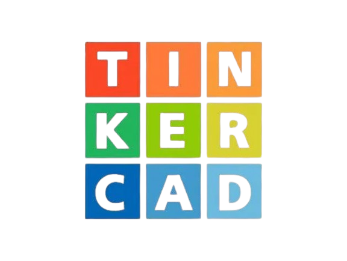

  
  
  
  

<h2 align="center">
  Proyecto Exopierna Robótica Asistida
</h2>

  Desarrollo académico y tecnológico enfocado en asistencia motriz mediante integración de hardware, software, simulación y modelado 3D.

---

# <strong>Descripción General</strong>

Este proyecto tiene como objetivo el desarrollo de una exopierna robótica orientada a asistir a personas que han perdido parcial o totalmente la fuerza en las piernas.  

La propuesta se centra en un enfoque tecnológico y ético, buscando contribuir al apoyo motriz, accesibilidad y mejora de calidad de vida mediante sistemas electrónicos y programación embebida.

El proyecto integra:
- Diseño electrónico
- Programación de microcontroladores
- Simulación de circuitos
- Diseño y fabricación PCB
- Modelado 3D
- Desarrollo colaborativo mediante GitHub

Todo el contenido relacionado con el proyecto será documentado y almacenado dentro de este repositorio.

---

# <strong>Herramientas y Tecnologías</strong>

## <strong>ESP32</strong>

  

- Microcontrolador principal del proyecto
- Control de sensores y actuadores
- Programación en C++
- Comunicación y procesamiento embebido

---

## <strong>Proteus</strong>

  

- Simulación de circuitos electrónicos
- Pruebas virtuales de componentes
- Diseño y validación electrónica previa

---

## <strong>Tinkercad</strong>

  

- Simulación básica de circuitos
- Prototipado electrónico inicial
- Validación de conexiones y lógica

---

## <strong>Blender</strong>

  

- Modelado 3D de la exopierna
- Diseño visual del prototipo
- Representación estructural del sistema

---

## <strong>Arduino IDE</strong>

  

- Desarrollo y carga del código
- Programación del ESP32 en C++
- Gestión de librerías y pruebas

---

## <strong>Diseño PCB y Serigrafía</strong>

- Diseño de placas electrónicas
- Grabado de pistas PCB
- Fabricación de prototipos físicos
- Integración de componentes electrónicos

---

# <strong>Contenido del Repositorio</strong>

Dentro de este repositorio se almacenará:

- Código fuente del proyecto
- Diagramas electrónicos
- Simulaciones
- Archivos de Proteus
- Modelos 3D
- Diseños PCB
- Documentación técnica
- Avances del proyecto
- Investigaciones
- Datasheets
- Evidencias y pruebas

---

# <strong>Trabajo Colaborativo</strong>

GitHub será utilizado como plataforma principal para:

- Control de versiones
- Organización del proyecto
- Gestión colaborativa
- Seguimiento de avances
- Documentación continua
- Integración de aportes del equipo

---

# <strong>Objetivos</strong>

- Desarrollar una exopierna funcional
- Implementar asistencia motriz mediante electrónica y programación
- Simular el comportamiento del sistema antes de su fabricación
- Diseñar prototipos físicos y digitales
- Integrar hardware y software de manera eficiente
- Mantener documentación técnica organizada

---

# <strong>Estado del Proyecto</strong>

Proyecto actualmente en fase inicial de investigación, simulación y prototipado.

---

# <strong>Licencia</strong>

Proyecto académico desarrollado con fines educativos, tecnológicos e investigativos.